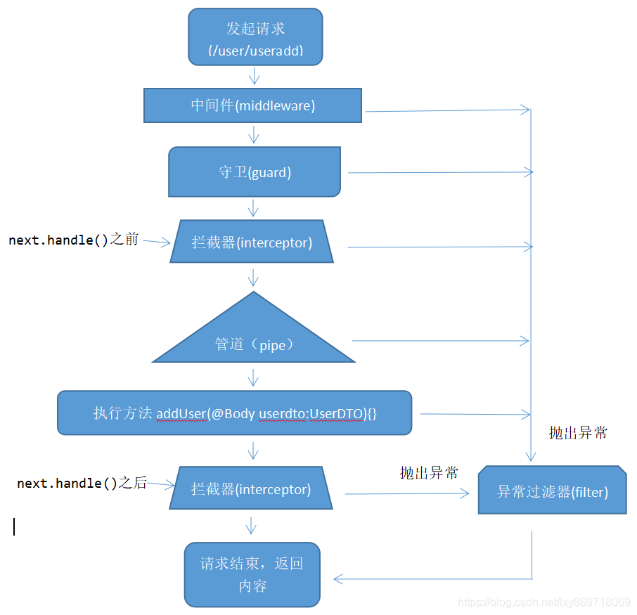
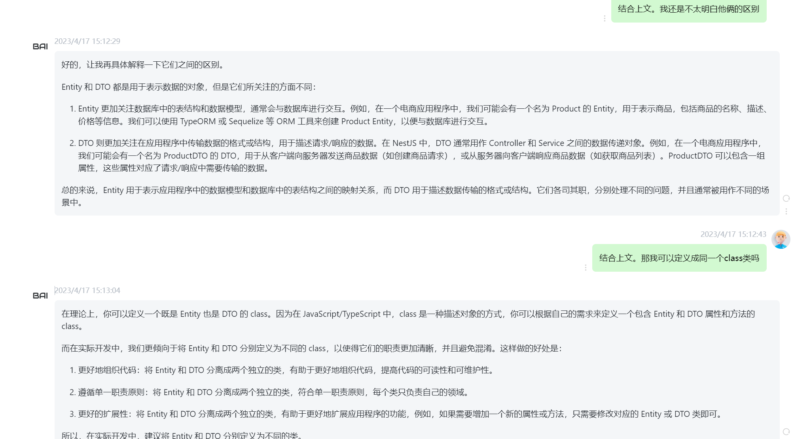

# nestjs学习
~~可以用我的数据库，大哥们，别删库啊~~   
现在好了，开启用户名 密码认证就没事了。     
[nestjs中文官网](https://docs.nestjs.cn/)         
[typeorm中文官网](https://typeorm.devjs.cn/)
[思否上的教程，注意版本已过时，可能有坑](https://segmentfault.com/a/1190000041904772)
## nestjs 执行顺序
 
## typeorm 数据库相关
- [CRUD教程资料](https://blog.csdn.net/lxy869718069/article/details/110128030)
## mongoose 
mongodb数据库不使用typeorm了。使用[mongoose](https://docs.mongoing.com/)   
[掘金上的一篇文章讲解](https://juejin.cn/post/6844904054196273159)
## mongodb id查询无效
项目已经锁死mongodb 和typeorm版本号。切勿升级，会有莫名其妙的错误。              
## TODO
- typeorm中使用mongodb，Like
```
  // 分页接口
  async findAll(query?: ReqPage) {
    const { page = 1, pageSize = 10, params } = query;
    const { firstName, lastName, age } = params;
    const where = {};
    // 这里的逻辑是，如果有传入参数，就加入到 where 条件中 模糊查询
    if (firstName) {
      where['firstName'] = Like(`%${firstName}%`);
    }
    if (lastName) {
      where['lastName'] = Like(`%${lastName}%`);
    }
    if (age) {
      where['age'] = age;
    }

    const [items, total] = await this.userRepository.findAndCount({
      skip: (page - 1) * pageSize,
      take: pageSize,
      where,
      order: {
        id: 'ASC',
      },
    });

    return {
      items,
      total,
      page,
      pageSize,
    };
  }
```


## cli 
nest g    
Generate a Nest element.    
Schematics available on @nestjs/schematics collection:
```
┌───────────────┬─────────────┬──────────────────────────────────────────────┐
│ name          │ alias       │ description                                  │
│ application   │ application │ Generate a new application workspace         │
│ class         │ cl          │ Generate a new class                         │
│ configuration │ config      │ Generate a CLI configuration file            │
│ controller    │ co          │ Generate a controller declaration            │
│ decorator     │ d           │ Generate a custom decorator                  │
│ filter        │ f           │ Generate a filter declaration                │
│ gateway       │ ga          │ Generate a gateway declaration               │
│ guard         │ gu          │ Generate a guard declaration                 │
│ interceptor   │ itc         │ Generate an interceptor declaration          │
│ interface     │ itf         │ Generate an interface                        │
│ middleware    │ mi          │ Generate a middleware declaration            │
│ module        │ mo          │ Generate a module declaration                │
│ pipe          │ pi          │ Generate a pipe declaration                  │
│ provider      │ pr          │ Generate a provider declaration              │
│ resolver      │ r           │ Generate a GraphQL resolver declaration      │
│ service       │ s           │ Generate a service declaration               │
│ library       │ lib         │ Generate a new library within a monorepo     │
│ sub-app       │ app         │ Generate a new application within a monorepo │
│ resource      │ res         │ Generate a new CRUD resource                 │
└───────────────┴─────────────┴──────────────────────────────────────────────┘
```
## validator 
###　常见的验证装饰器	
- @IsDefined(value: any)	检查值是否已定义（!== 未定义，!== null）。这是唯一忽略 skipMissingProperties 选项的装饰器。　　
- @IsOptional()	检查给定值是否为空（=== null，=== undefined），如果是，则忽略属性上的所有验证器。　
- @Equals(comparison: any)	检查值是否等于（“===”）比较。　　　
- @NotEquals(comparison: any)	检查值是否不相等（“！==”）比较。　　　
- @IsEmpty()	检查给定值是否为空（=== ''、=== null、=== undefined）。　　
- @IsNotEmpty()	检查给定值是否不为空（!== '', !== null, !== undefined）。　　　　　　
- @IsIn(values: any[])	检查值是否在允许值数组中。　　　
- @IsNotIn(values: any[])	检查值是否不在不允许值的数组中。　　
###　类型验证装饰器	
- @IsBoolean()	检查值是否为布尔值。
- @IsDate()	检查值是否为日期。
- @IsString()	检查值是否为字符串。
- @IsNumber(options: IsNumberOptions)	检查值是否为数字。
- @IsInt()	检查值是否为整数。
- @IsArray()	检查值是否为数组
- @IsEnum(entity: object)	检查该值是否是有效的枚举
###　数字验证装饰器	
- @IsDivisibleBy(num: number)	检查该值是否是可以被另一个整除的数字。
- @IsPositive()	检查该值是否为大于零的正数。
- @IsNegative()	检查该值是否为小于零的负数。
- @Min(min: number)	检查给定数字是否大于或等于给定数字。
- @Max(max: number)	检查给定数字是否小于或等于给定数字。
###　日期验证装饰器	
- @MinDate(date: Date | (() => Date))	检查该值是否是指定日期之后的日期。
- @MaxDate(date: Date | (() => Date))	检查该值是否是指定日期之前的日期。
###　字符串类型验证装饰器	
- @IsBooleanString()	检查字符串是否为布尔值(e.g. is "true" or "false" or "1", "0").
- @IsDateString()	的别名@IsISO8601()。
- @IsNumberString(options?: IsNumericOptions)	检查字符串是否为数字。
###　字符串验证装饰器	
- @Contains(seed: string)	检查字符串是否包含种子。
- @NotContains(seed: string)	检查字符串是否不包含种子。
- @IsAlpha()	检查字符串是否仅包含字母 (a-zA-Z)。
- @IsAlphanumeric()	检查字符串是否仅包含字母和数字。
- @IsDecimal(options?: IsDecimalOptions)	检查字符串是否为有效的十进制值。默认 IsDecimalOptions 是force_decimal=False, decimal_digits: '1,',locale: 'en-US'
- @IsAscii()	检查字符串是否仅包含 ASCII 字符。
- @IsBase32()	检查字符串是否为 base32 编码。
- @IsBase58()	检查字符串是否为 base58 编码。
- @IsBase64(options?: IsBase64Options)	检查字符串是否为 base64 编码。
- @IsIBAN()	检查字符串是否为 IBAN（国际银行帐号）。
- @IsBIC()	检查字符串是 BIC（银行识别代码）还是 SWIFT 代码。
- @IsByteLength(min: number, max?: number)	检查字符串的长度（以字节为单位）是否在一个范围内。
- @IsCreditCard()	检查字符串是否为信用卡。
- @IsCurrency(options?: IsCurrencyOptions)	检查字符串是否是有效的货币金额。
- @IsISO4217CurrencyCode()	检查字符串是否为 ISO 4217 货币代码。
- @IsEthereumAddress()	使用基本正则表达式检查字符串是否为以太坊地址。不验证地址校验和。
- @IsBtcAddress()	检查字符串是否是有效的 BTC 地址。
- @IsDataURI()	检查字符串是否为数据 uri 格式。
- @IsEmail(options?: IsEmailOptions)	检查字符串是否为电子邮件。
- @IsFQDN(options?: IsFQDNOptions)	检查字符串是否是完全限定的域名（例如 domain.com）。
- @IsFullWidth()	检查字符串是否包含任何全角字符。
- @IsHalfWidth()	检查字符串是否包含任何半角字符。
- @IsVariableWidth()	检查字符串是否包含全角字符和半角字符的混合。
- @IsHexColor()	检查字符串是否为十六进制颜色。
- @IsHSL()	检查字符串是否是基于CSS Colors Level 4 specification的 HSL 颜色。
- @IsRgbColor(options?: IsRgbOptions)	检查字符串是 rgb 还是 rgba 颜色。
- @IsIdentityCard(locale?: string)	检查字符串是否是有效的身份证代码。
- @IsPassportNumber(countryCode?: string)	检查字符串是否是相对于特定国家/地区代码的有效护照号码。
-  @IsPostalCode(locale?: string)	检查字符串是否为邮政编码。
-  @IsHexadecimal()	检查字符串是否为十六进制数。
-  @IsOctal()	检查字符串是否为八进制数。
-  @IsMACAddress(options?: IsMACAddressOptions)	检查字符串是否为 MAC 地址。
-  @IsIP(version?: "4"|"6")	检查字符串是否为 IP（版本 4 或 6）。
-  @IsPort()	检查字符串是否是有效的端口号。
-  @IsISBN(version?: "10"|"13")	检查字符串是否为 ISBN（版本 10 或 13）。
-  @IsEAN()	检查字符串是否为 EAN（欧洲商品编号）。
-  @IsISIN()	检查字符串是否为 ISIN（股票/证券标识符）。
-  @IsISO8601(options?: IsISO8601Options)	检查字符串是否为有效的 ISO 8601 日期格式。使用选项 strict = true 对有效日期进行额外检查。
-  @IsJSON()	检查字符串是否为有效的 JSON。
-  @IsJWT()	检查字符串是否为有效的 JWT。
-  @IsObject()	检查对象是否为有效对象（null、函数、数组将返回 false）。
-  @IsNotEmptyObject()	检查对象是否不为空。
-  @IsLowercase()	检查字符串是否为小写。
-  @IsLatLong()	检查字符串是否为格式为 lat, long 的有效经纬度坐标。
-  @IsLatitude()	检查字符串或数字是否是有效的纬度坐标。
-  @IsLongitude()	检查字符串或数字是否是有效的经度坐标。
-  @IsMobilePhone(locale: string)	检查字符串是否为手机号码。
-  @IsISO31661Alpha2()	检查字符串是否是有效的 ISO 3166-1 alpha-2 官方分配的国家代码。
-  @IsISO31661Alpha3()	检查字符串是否是有效的 ISO 3166-1 alpha-3 官方分配的国家代码。
-  @IsLocale()	检查字符串是否是语言环境。
-  @IsPhoneNumber(region: string)	使用 libphonenumber-js 检查字符串是否是有效的电话号码。
-  @IsMongoId()	检查字符串是否是 MongoDB ObjectId 的有效十六进制编码表示。
-  @IsMultibyte()	检查字符串是否包含一个或多个多字节字符。
-  @IsNumberString(options?: IsNumericOptions)	检查字符串是否为数字。
-  @IsSurrogatePair()	检查字符串是否包含任何代理项对字符。
-  @IsTaxId()	检查字符串是否是有效的税号。默认语言环境是en-US.
-  @IsUrl(options?: IsURLOptions)	检查字符串是否为 URL。
-  @IsMagnetURI()	检查字符串是否为磁铁 uri 格式。
-  @IsUUID(version?: UUIDVersion)	检查字符串是否为 UUID（版本 3、4、5 或全部）。
-  @IsFirebasePushId()	检查字符串是否为Firebase 推送 ID
-  @IsUppercase()	检查字符串是否为大写。
-  @Length(min: number, max?: number)	检查字符串的长度是否在一个范围内。
-  @MinLength(min: number)	检查字符串的长度是否不小于给定的数字。
-  @MaxLength(max: number)	检查字符串的长度是否不超过给定的数字。
-  @Matches(pattern: RegExp, modifiers?: string)	检查字符串是否与模式匹配。matches('foo', /foo/i) 或 matches('foo', 'foo', 'i')。
-  @IsMilitaryTime()	检查字符串是否是 HH:MM 格式的军事时间的有效表示。
-  @IsTimeZone()	检查字符串是否代表有效的 IANA 时区。
-  @IsHash(algorithm: string)	检查字符串是否为散列 支持以下类型：md4, md5, sha1, sha256, sha384, sha512, ripemd128, ripemd160, tiger128, tiger160, tiger192, crc32, crc32b.
-  @IsMimeType()	检查字符串是否匹配有效的MIME 类型格式
-  @IsSemVer()	检查字符串是否是语义版本控制规范 (SemVer)。
-  @IsISSN(options?: IsISSNOptions)	检查字符串是否为 ISSN。
-  @IsISRC()	检查字符串是否为ISRC。
-  @IsRFC3339()	检查字符串是否为有效的RFC 3339日期。
-  @IsStrongPassword(options?: IsStrongPasswordOptions)	检查字符串是否为强密码。
###　数组验证装饰器	
-  @ArrayContains(values: any[])	检查数组是否包含给定值数组中的所有值。
-  @ArrayNotContains(values: any[])	检查数组是否不包含任何给定值。
-  @ArrayNotEmpty()	检查给定数组是否不为空。
-  @ArrayMinSize(min: number)	检查数组的长度是否大于或等于指定的数字。
-  @ArrayMaxSize(max: number)	检查数组的长度是否小于或等于指定的数字。
-  @ArrayUnique(identifier?: (o) => any)	检查所有数组的值是否唯一。对象的比较是基于引用的。可选函数可以指定哪个返回值将用于比较。
###　对象验证装饰器	
-  @IsInstance(value: any)	检查属性是否是传递值的实例。
###　其他装饰器	
-  @Allow()	当没有为它指定其他约束时，防止剥离该属性。


##　winston 字段简介filename：输出的文件名字
- datePattern：时间格式化
- zippedArchive：将旧日志压缩存起来
- maxSize：单个文件最大多少m
- maxFiles:10d,100m分别为保存10天，10天以前的自动删除，文件大小超过100m时将旧文件删除，不写的话，猜测应该是不删除文件，源码中默认是null（待测试）
- colorize:布尔值，是否将日志显示为彩色，但是这个需要系统支持
- handleExceptions：捕获异常，猜测应该需要和try catch结合使用，暂时不清楚和e.stack的区别
- level:打印什么级别的日志
- label:在日志中加进去的，目前作用不明，但直觉应该可以作为查询时候的标记
- timestamp：时间戳，默认不加，是一个函数，在combine中添加之后，系统会自动添加时间戳，时间戳的格式和datePattern保持一致
- prettyPrint：美化输出日志的格式，相当于代码格式化
- format.errors({ stack: true })：这个会输出e.stack，但是前提你要在log.error(e)中传入e,
注意：
- logerr.error('参数1',e);
- logerr.error('参数1','参数2');
这两个函数的区别是:第二个只能输出message:参数1，第一个函数：既可以输出参数1，同时能输出e.stack，- logerr.error('参数1',e); logerr.error(e); logerr.error(e,'参数1');这三个写法得到的结果是一样的
- transports:
- new transports.Console:打印日志到控制台
- new (transports.DailyRotateFile)(DailyRotateFileOptions)：打印日志到文件，上面的是用了-winston-daily-rotate-file，这个插件是非常有用的，解决了按天写日志的问题

## typeorm mongodb
```
import { ObjectLiteral } from "../common/ObjectLiteral";
import { Repository } from "./Repository";
import { MongoFindManyOptions } from "../find-options/mongodb/MongoFindManyOptions";
import { AggregationCursor, BulkWriteOpResultObject, Code, Collection, CollectionAggregationOptions, CollectionBulkWriteOptions, CollectionInsertManyOptions, CollectionInsertOneOptions, CollectionOptions, CollStats, CommandCursor, Cursor, DeleteWriteOpResultObject, FindAndModifyWriteOpResultObject, FindOneAndReplaceOption, GeoHaystackSearchOptions, GeoNearOptions, InsertOneWriteOpResult, InsertWriteOpResult, MapReduceOptions, MongoCountPreferences, MongodbIndexOptions, ObjectID, OrderedBulkOperation, ParallelCollectionScanOptions, ReadPreference, ReplaceOneOptions, UnorderedBulkOperation, UpdateWriteOpResult } from "../driver/mongodb/typings";
import { MongoEntityManager } from "../entity-manager/MongoEntityManager";
import { QueryRunner } from "../query-runner/QueryRunner";
import { SelectQueryBuilder } from "../query-builder/SelectQueryBuilder";
import { MongoFindOneOptions } from "../find-options/mongodb/MongoFindOneOptions";
import { FindOneOptions } from "../find-options/FindOneOptions";
/**
 * Repository used to manage mongodb documents of a single entity type.
 */
export declare class MongoRepository<Entity extends ObjectLiteral> extends Repository<Entity> {
    /**
     * Entity Manager used by this repository.
     */
    readonly manager: MongoEntityManager;
    /**
     * Raw SQL query execution is not supported by MongoDB.
     * Calling this method will return an error.
     */
    query(query: string, parameters?: any[]): Promise<any>;
    /**
     * Using Query Builder with MongoDB is not supported yet.
     * Calling this method will return an error.
     */
    createQueryBuilder(alias: string, queryRunner?: QueryRunner): SelectQueryBuilder<Entity>;
    /**
     * Finds entities that match given find options or conditions.
     */
    find(options?: MongoFindManyOptions<Entity>): Promise<Entity[]>;
    /**
     * Finds entities that match given find options or conditions.
     */
    findBy(where: any): Promise<Entity[]>;
    /**
     * Finds entities that match given find options or conditions.
     * Also counts all entities that match given conditions,
     * but ignores pagination settings (from and take options).
     */
    findAndCount(options?: MongoFindManyOptions<Entity>): Promise<[Entity[], number]>;
    /**
     * Finds entities that match given find options or conditions.
     * Also counts all entities that match given conditions,
     * but ignores pagination settings (from and take options).
     */
    findAndCountBy(where: any): Promise<[Entity[], number]>;
    /**
     * Finds entities by ids.
     * Optionally find options can be applied.
     *
     * @deprecated use `findBy` method instead in conjunction with `In` operator, for example:
     *
     * .findBy({
     *     id: In([1, 2, 3])
     * })
     */
    findByIds(ids: any[], options?: any): Promise<Entity[]>;
    /**
     * Finds first entity that matches given find options.
     */
    findOne(options: MongoFindOneOptions<Entity>): Promise<Entity | null>;
    /**
     * Finds first entity that matches given WHERE conditions.
     */
    findOneBy(where: any): Promise<Entity | null>;
    /**
     * Finds entity that matches given id.
     *
     * @deprecated use `findOneBy` method instead in conjunction with `In` operator, for example:
     *
     * .findOneBy({
     *     id: 1 // where "id" is your primary column name
     * })
     */
    findOneById(id: string | string[] | number | number[] | Date | Date[] | ObjectID | ObjectID[]): Promise<Entity | null>;
    /**
     * Finds first entity by a given find options.
     * If entity was not found in the database - rejects with error.
     */
    findOneOrFail(options: FindOneOptions<Entity>): Promise<Entity>;
    /**
     * Finds first entity that matches given where condition.
     * If entity was not found in the database - rejects with error.
     */
    findOneByOrFail(where: any): Promise<Entity>;
    /**
     * Creates a cursor for a query that can be used to iterate over results from MongoDB.
     */
    createCursor<T = any>(query?: ObjectLiteral): Cursor<T>;
    /**
     * Creates a cursor for a query that can be used to iterate over results from MongoDB.
     * This returns modified version of cursor that transforms each result into Entity model.
     */
    createEntityCursor(query?: ObjectLiteral): Cursor<Entity>;
    /**
     * Execute an aggregation framework pipeline against the collection.
     */
    aggregate<R = any>(pipeline: ObjectLiteral[], options?: CollectionAggregationOptions): AggregationCursor<R>;
    /**
     * Execute an aggregation framework pipeline against the collection.
     * This returns modified version of cursor that transforms each result into Entity model.
     */
    aggregateEntity(pipeline: ObjectLiteral[], options?: CollectionAggregationOptions): AggregationCursor<Entity>;
    /**
     * Perform a bulkWrite operation without a fluent API.
     */
    bulkWrite(operations: ObjectLiteral[], options?: CollectionBulkWriteOptions): Promise<BulkWriteOpResultObject>;
    /**
     * Count number of matching documents in the db to a query.
     */
    count(query?: ObjectLiteral, options?: MongoCountPreferences): Promise<number>;
    /**
     * Count number of matching documents in the db to a query.
     */
    countBy(query?: ObjectLiteral, options?: MongoCountPreferences): Promise<number>;
    /**
     * Creates an index on the db and collection.
     */
    createCollectionIndex(fieldOrSpec: string | any, options?: MongodbIndexOptions): Promise<string>;
    /**
     * Creates multiple indexes in the collection, this method is only supported for MongoDB 2.6 or higher.
     * Earlier version of MongoDB will throw a command not supported error.
     * Index specifications are defined at http://docs.mongodb.org/manual/reference/command/createIndexes/.
     */
    createCollectionIndexes(indexSpecs: ObjectLiteral[]): Promise<void>;
    /**
     * Delete multiple documents on MongoDB.
     */
    deleteMany(query: ObjectLiteral, options?: CollectionOptions): Promise<DeleteWriteOpResultObject>;
    /**
     * Delete a document on MongoDB.
     */
    deleteOne(query: ObjectLiteral, options?: CollectionOptions): Promise<DeleteWriteOpResultObject>;
    /**
     * The distinct command returns returns a list of distinct values for the given key across a collection.
     */
    distinct(key: string, query: ObjectLiteral, options?: {
        readPreference?: ReadPreference | string;
    }): Promise<any>;
    /**
     * Drops an index from this collection.
     */
    dropCollectionIndex(indexName: string, options?: CollectionOptions): Promise<any>;
    /**
     * Drops all indexes from the collection.
     */
    dropCollectionIndexes(): Promise<any>;
    /**
     * Find a document and delete it in one atomic operation, requires a write lock for the duration of the operation.
     */
    findOneAndDelete(query: ObjectLiteral, options?: {
        projection?: Object;
        sort?: Object;
        maxTimeMS?: number;
    }): Promise<FindAndModifyWriteOpResultObject>;
    /**
     * Find a document and replace it in one atomic operation, requires a write lock for the duration of the operation.
     */
    findOneAndReplace(query: ObjectLiteral, replacement: Object, options?: FindOneAndReplaceOption): Promise<FindAndModifyWriteOpResultObject>;
    /**
     * Find a document and update it in one atomic operation, requires a write lock for the duration of the operation.
     */
    findOneAndUpdate(query: ObjectLiteral, update: Object, options?: FindOneAndReplaceOption): Promise<FindAndModifyWriteOpResultObject>;
    /**
     * Execute a geo search using a geo haystack index on a collection.
     */
    geoHaystackSearch(x: number, y: number, options?: GeoHaystackSearchOptions): Promise<any>;
    /**
     * Execute the geoNear command to search for items in the collection.
     */
    geoNear(x: number, y: number, options?: GeoNearOptions): Promise<any>;
    /**
     * Run a group command across a collection.
     */
    group(keys: Object | Array<any> | Function | Code, condition: Object, initial: Object, reduce: Function | Code, finalize: Function | Code, command: boolean, options?: {
        readPreference?: ReadPreference | string;
    }): Promise<any>;
    /**
     * Retrieve all the indexes on the collection.
     */
    collectionIndexes(): Promise<any>;
    /**
     * Retrieve all the indexes on the collection.
     */
    collectionIndexExists(indexes: string | string[]): Promise<boolean>;
    /**
     * Retrieves this collections index info.
     */
    collectionIndexInformation(options?: {
        full: boolean;
    }): Promise<any>;
    /**
     * Initiate an In order bulk write operation, operations will be serially executed in the order they are added, creating a new operation for each switch in types.
     */
    initializeOrderedBulkOp(options?: CollectionOptions): OrderedBulkOperation;
    /**
     * Initiate a Out of order batch write operation. All operations will be buffered into insert/update/remove commands executed out of order.
     */
    initializeUnorderedBulkOp(options?: CollectionOptions): UnorderedBulkOperation;
    /**
     * Inserts an array of documents into MongoDB.
     */
    insertMany(docs: ObjectLiteral[], options?: CollectionInsertManyOptions): Promise<InsertWriteOpResult>;
    /**
     * Inserts a single document into MongoDB.
     */
    insertOne(doc: ObjectLiteral, options?: CollectionInsertOneOptions): Promise<InsertOneWriteOpResult>;
    /**
     * Returns if the collection is a capped collection.
     */
    isCapped(): Promise<any>;
    /**
     * Get the list of all indexes information for the collection.
     */
    listCollectionIndexes(options?: {
        batchSize?: number;
        readPreference?: ReadPreference | string;
    }): CommandCursor;
    /**
     * Run Map Reduce across a collection. Be aware that the inline option for out will return an array of results not a collection.
     */
    mapReduce(map: Function | string, reduce: Function | string, options?: MapReduceOptions): Promise<any>;
    /**
     * Return N number of parallel cursors for a collection allowing parallel reading of entire collection.
     * There are no ordering guarantees for returned results.
     */
    parallelCollectionScan(options?: ParallelCollectionScanOptions): Promise<Cursor<Entity>[]>;
    /**
     * Reindex all indexes on the collection Warning: reIndex is a blocking operation (indexes are rebuilt in the foreground) and will be slow for large collections.
     */
    reIndex(): Promise<any>;
    /**
     * Reindex all indexes on the collection Warning: reIndex is a blocking operation (indexes are rebuilt in the foreground) and will be slow for large collections.
     */
    rename(newName: string, options?: {
        dropTarget?: boolean;
    }): Promise<Collection<any>>;
    /**
     * Replace a document on MongoDB.
     */
    replaceOne(query: ObjectLiteral, doc: ObjectLiteral, options?: ReplaceOneOptions): Promise<UpdateWriteOpResult>;
    /**
     * Get all the collection statistics.
     */
    stats(options?: {
        scale: number;
    }): Promise<CollStats>;
    /**
     * Update multiple documents on MongoDB.
     */
    updateMany(query: ObjectLiteral, update: ObjectLiteral, options?: {
        upsert?: boolean;
        w?: any;
        wtimeout?: number;
        j?: boolean;
    }): Promise<UpdateWriteOpResult>;
    /**
     * Update a single document on MongoDB.
     */
    updateOne(query: ObjectLiteral, update: ObjectLiteral, options?: ReplaceOneOptions): Promise<UpdateWriteOpResult>;
}

```

## 映射类型
[文档地址](https://docs.nestjs.cn/9/techniques?id=%e9%aa%8c%e8%af%81)
- PartialType 必填变成可选  
PartialType() 函数返回一个类型（一个类）包含被设置成可选的所有输入类型的属性。 
- PickType 选择类型  
PickType() 函数通过挑出输入类型的一组属性构造一个新的类型（类）。

- OmitType() 函数通过挑出输入类型中的全部属性，然后移除一组特定的属性构造一个类型
- IntersectionType() 函数将两个类型合并成一个类型。
## DTO 与 Entity 的区别
- DTO 是数据传输对象，用于接收请求数据，或者返回响应数据。
- Entity 是实体对象，用于操作数据库，或者返回响应数据。


##　Winston
Winston 是一个流行的 Node.js 日志记录库。它支持多种日志级别，包括：
```
error：用于记录错误事件
warn：用于记录警告事件
info：用于记录有意义的事件信息
verbose：用于记录详细信息
debug：用于调试应用程序
silly：用于记录无关紧要的信息
```

您可以根据需要通过 Logger.level 属性设置全局日志级别或为特定传输器设置单独的日志级别。默认日志级别为 info。例如，以下代码将日志级别设置为 debug：
```

const winston = require('winston');

const logger = winston.createLogger({
    level: 'debug',
    transports: [new winston.transports.Console()]
});
```

这将启用所有日志级别，从 error 到 silly。请注意，在生产环境中，仅应启用必要的日志级别以避免不必要的性能开销。

## nestjs 内置的http异常
- BadRequestException：它表示客户端发送了一个无效的请求。例如，如果缺少必需的查询参数或请求体，则可能会引发此异常。[400 Bad Request]
- UnauthorizedException：这表示客户端未经身份验证或没有所需的权限来访问资源。当客户端尝试访问受保护的资源但没有提供有效的凭证时，通常会引发此异常。[401 Unauthorized]
- NotFoundException：这表示客户端尝试访问不存在的资源。例如，当客户端尝试访问不存在的用户 ID 时，通常会引发此异常。[404 Not Found]
- ForbiddenException：如名称所示，它表示客户端尝试访问被禁止的资源。当客户端尝试访问其没有权访问的资源时，通常会引发此异常。 [403 Forbidden]
- NotAcceptableException：这表示客户端请求的内容类型不受支持。当客户端请求的内容类型与服务器不匹配时，通常会引发此异常。[406 Not Acceptable]
- RequestTimeoutException：这表示客户端的请求已超时。如果请求在服务器可以响应之前花费了太长时间，则通常会引发此异常。[408 Request Timeout]
- ConflictException：这表示请求会导致冲突。例如，在尝试创建具有重复唯一标识符的资源时，通常会引发此异常。[409 Conflict]
- GoneException：这表示客户端请求的资源不再可用。通常在客户端尝试访问已被删除或过时的资源时引发。[410 Gone]
- PayloadTooLargeException：这表示客户端发送的负载太大，服务器无法处理。例如，当客户端尝试上传超出服务器限制的文件时，通常会引发此异常。[413 Payload Too Large]
- UnsupportedMediaTypeException：这表示客户端请求的内容类型不受支持。例如，在使用不支持的媒体类型进行文件上传时，通常会引发此异常。[415 Unsupported Media Type]
- UnprocessableException：这表示由于请求无法处理而导致的错误。它可以用于任何不能归类为其他 HTTP 异常的自定义异常。[422 Unprocessable Entity]
- InternalServerErrorException：这表示服务器内部错误。当服务器遇到未知错误时，通常会引发此异常。[500 Internal Server Error]
- NotImplementedException：这表示客户端尝试访问尚未实现的功能。例如，当客户端尝试访问尚未实现的 API 端点时，通常会引发此异常。[501 Not Implemented]
- BadGatewayException：这表示代理或网关无法完成请求。例如，当代理服务器无法从上游服务器获取响应时，通常会引发此异常。[502 Bad Gateway]
- ServiceUnavailableException：这表示服务不可用。当服务器无法处理请求时，例如正在进行维护或超载时，通常会引发此异常。[503 Service Unavailable]
- GatewayTimeoutException：这表示网关超时。当网关无法在一定时间内从上游服务器获取响应时，通常会引发此异常。[504 Gateway Timeout]
## nestjs 内置的状态码
```
declare enum HttpStatus {
    CONTINUE = 100,
    SWITCHING_PROTOCOLS = 101,
    PROCESSING = 102,
    EARLYHINTS = 103,
    OK = 200,
    CREATED = 201,
    ACCEPTED = 202,
    NON_AUTHORITATIVE_INFORMATION = 203,
    NO_CONTENT = 204,
    RESET_CONTENT = 205,
    PARTIAL_CONTENT = 206,
    AMBIGUOUS = 300,
    MOVED_PERMANENTLY = 301,
    FOUND = 302,
    SEE_OTHER = 303,
    NOT_MODIFIED = 304,
    TEMPORARY_REDIRECT = 307,
    PERMANENT_REDIRECT = 308,
    BAD_REQUEST = 400,
    UNAUTHORIZED = 401,
    PAYMENT_REQUIRED = 402,
    FORBIDDEN = 403,
    NOT_FOUND = 404,
    METHOD_NOT_ALLOWED = 405,
    NOT_ACCEPTABLE = 406,
    PROXY_AUTHENTICATION_REQUIRED = 407,
    REQUEST_TIMEOUT = 408,
    CONFLICT = 409,
    GONE = 410,
    LENGTH_REQUIRED = 411,
    PRECONDITION_FAILED = 412,
    PAYLOAD_TOO_LARGE = 413,
    URI_TOO_LONG = 414,
    UNSUPPORTED_MEDIA_TYPE = 415,
    REQUESTED_RANGE_NOT_SATISFIABLE = 416,
    EXPECTATION_FAILED = 417,
    I_AM_A_TEAPOT = 418,
    MISDIRECTED = 421,
    UNPROCESSABLE_ENTITY = 422,
    FAILED_DEPENDENCY = 424,
    PRECONDITION_REQUIRED = 428,
    TOO_MANY_REQUESTS = 429,
    INTERNAL_SERVER_ERROR = 500,
    NOT_IMPLEMENTED = 501,
    BAD_GATEWAY = 502,
    SERVICE_UNAVAILABLE = 503,
    GATEWAY_TIMEOUT = 504,
    HTTP_VERSION_NOT_SUPPORTED = 505
}

```
## 装饰器的执行顺序
假设；
```
class CheckVerifyCodeDto {
  @ApiProperty({ example: 'GaBUGhJzESU=' })
  @IsNotEmpty({ message: '请输入验证码ID' })
  id: string;

  @ApiProperty({ example: '0000' })
  @Length(4, 4, { message: '验证码长度为4位' })
  @IsNotEmpty({ message: '请输入验证码' })
  code: string;
}

```
在 CheckVerifyCodeDto 中，@Length 装饰器在 @IsNotEmpty 装饰器的右边，它们的执行顺序就是从右到左。 所以，在这个例子中，CheckVerifyCodeDto 的执行顺序为：

1. @Length(4, 4, { message: '验证码长度为4位' })
2. @IsNotEmpty({ message: '请输入验证码' })
3. @ApiProperty({ example: 'GaBUGhJzESU=' })
4. @ApiProperty({ example: '0000' })   


也就是说，@Length 先执行，然后是 @IsNotEmpty，再后是 @ApiProperty。
